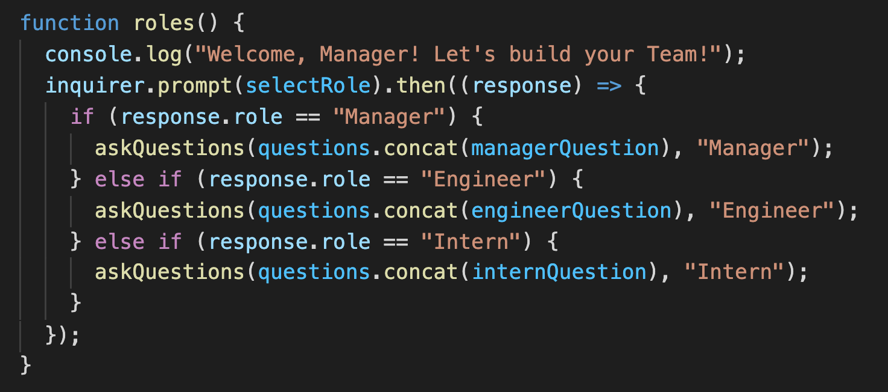
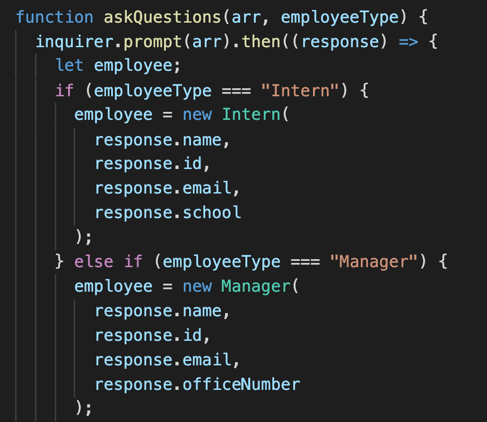

# employee-team-generator

  # Description
  
  This Node CLI takes in employee information and generates an HTML page displaying each team member's details.  

  # Table of Contents  
 
  * [Installation](#installation)  
  * [Usage](#usage)
  * [Demo](#demo)
  * [Technology Used](#technology)   
  * [Questions](#questions) 
  * [Tests](#tests)  
  * [License](#license)

  ## Installation  
  The dependencies are, [jest](https://jestjs.io/) for running the provided tests, and [inquirer](https://www.npmjs.com/package/inquirer) for collecting input from the user.  
  
  Run  `npm install`. 

  ## Usage  
  Run  `node app.js` to begin. 
  
  The Manager is greeted and prompted to enter their name, ID number, email address and office number. Then they are given the option to add more employees to their team. They are then prompted to select the next Employee's role. Name, ID number and email are required for all Employees. 
  
  If the Manager is adding an Intern, they will be prompted for the Intern's school name. 
  
  If the Manager is adding an Engineer, they will be prompted for the Engineer's gitHub username. 

  Once the Team is complete, an HTML webpage is generated displaying the Team Roster with Employee summaries for each Team Member. 

  ## Demo
  View working demo here: [Demo]()

  Conditional statements determines which role specific questions will be pushed to the questions array and called by the askQuestion function.
    

  Based on the Employee Type selected, role specific responses are used to create a new Employee object.
  

  ## Technology
  Technology Used: JavaScript, HTML, CSS, NodeJS  
  Framework Used: Bootstrap

  ## Questions
  If you have any questions, please contact me at [Email](jenLkelly@gmail.com).  
  You can also visit my [Github Page](https://github.com/jkelly101).  

  ## Tests
  Test Suites: 4 passed, 4 total  
  Tests:       17 passed, 17 total

  ## License

* [License]https://choosealicense.com/licenses/mit/
  

  